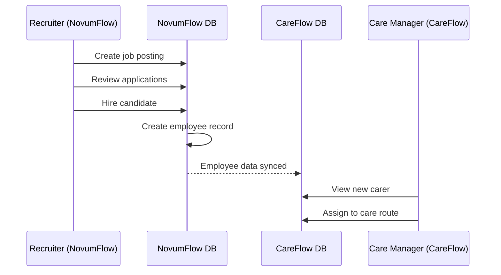
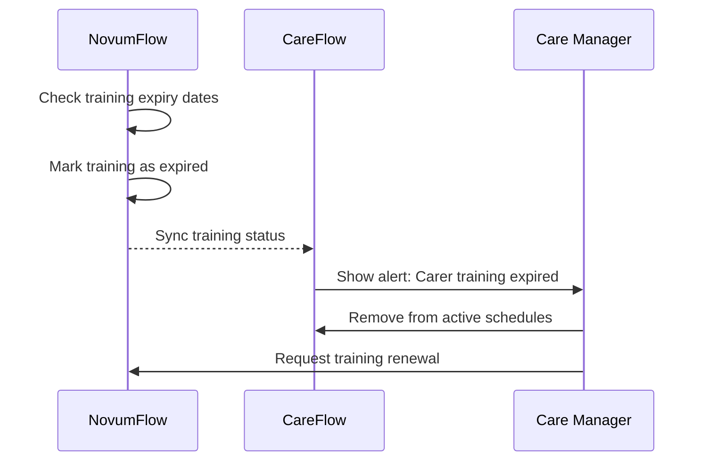

# 🏢 NovumFlow + CareFlow - Multi-Tenant SaaS Architecture

## 🎯 Overview

**NovumSolvo Ltd** provides two complementary SaaS applications that work together:

| Application | Purpose | Primary Users | Port (Dev) |
|-------------|---------|---------------|------------|
| **NovumFlow** | HR & Recruitment Management | HR Teams, Recruiters, Managers | :5173 |
| **CareFlow AI** | Care Management Platform | Care Managers, Carers, Families | :3000 |

### Business Model: Multi-Tenant SaaS

Similar to how **Access Mobizio** works with **Access People Planner**, these apps:
- 🏢 **Work independently** - Each app provides standalone value
- 🔗 **Integrate seamlessly** - Share data and workflows when used together
- 👥 **Multi-tenant** - Multiple organizations (tenants) use the same infrastructure
- 🔒 **Isolated** - Each tenant's data is completely separate
- 💰 **Subscription-based** - Tenants pay for what they use

---

## 🏗️ Architecture Overview

```
┌─────────────────────────────────────────────────────────────────┐
│                    NovumSolvo Platform                          │
├─────────────────────────────────────────────────────────────────┤
│                                                                 │
│  ┌────────────────────┐         ┌────────────────────┐        │
│  │   NovumFlow        │         │   CareFlow AI      │        │
│  │   (HR Platform)    │◄───────►│   (Care Platform)  │        │
│  │                    │  Shared │                    │        │
│  │  • Recruitment     │  Users  │  • Care Plans      │        │
│  │  • Onboarding      │  & Data │  • Visit Tracking  │        │
│  │  • Performance     │         │  • AI Assistance   │        │
│  │  • Training        │         │  • Medication      │        │
│  └────────────────────┘         └────────────────────┘        │
│           │                              │                      │
│           └──────────────┬───────────────┘                     │
│                          │                                      │
│                  ┌───────▼────────┐                           │
│                  │   Supabase     │                           │
│                  │   (Multi-Tenant)│                          │
│                  │                 │                           │
│                  │  • Auth         │                           │
│                  │  • Database     │                           │
│                  │  • Storage      │                           │
│                  │  • Edge Functions│                          │
│                  └─────────────────┘                           │
│                                                                 │
└─────────────────────────────────────────────────────────────────┘
```

---

## 🔑 Multi-Tenant Design

### Current Implementation

Both apps share the same Supabase instance with tenant isolation:

```sql
-- Every table has a tenant_id column
CREATE TABLE users_profiles (
    id UUID PRIMARY KEY,
    user_id UUID REFERENCES auth.users,
    tenant_id UUID REFERENCES tenants(id),  -- ← Tenant isolation
    email TEXT,
    role TEXT,
    -- ... other fields
);

-- RLS (Row Level Security) ensures data isolation
CREATE POLICY "Users see only their tenant data"
ON users_profiles
FOR SELECT
USING (tenant_id = current_tenant_id());
```

### Tenant Configuration

```sql
-- Tenants table
CREATE TABLE tenants (
    id UUID PRIMARY KEY DEFAULT gen_random_uuid(),
    name TEXT NOT NULL,
    subdomain TEXT UNIQUE,  -- e.g., 'ringsteadcare'
    settings JSONB,
    subscription_tier TEXT,
    created_at TIMESTAMPTZ DEFAULT NOW(),
    is_active BOOLEAN DEFAULT true
);

-- Example tenants
INSERT INTO tenants (name, subdomain, subscription_tier) VALUES
('Ringstead Care Home', 'ringsteadcare', 'enterprise'),
('Sunshine Care Services', 'sunshinecare', 'professional'),
('Community Care UK', 'communitycare', 'basic');
```

---

## 🔗 How the Apps Work Together

### Shared Resources

1. **User Accounts** 
   - Single login for both apps
   - Users can have different roles in each app
   - Shared authentication via Supabase Auth

2. **Employee/Carer Data**
   - Employee onboarded in **NovumFlow** → Automatically available in **CareFlow**
   - Training records sync between apps
   - DBS checks and compliance tracked centrally

3. **Documents & Files**
   - Shared document storage (Supabase Storage)
   - Employee documents accessible in both apps
   - Care-specific documents in CareFlow

### Integration Points

```typescript
// Example: Get employee from NovumFlow for use in CareFlow

// In NovumFlow: Create employee
await supabase.from('employees').insert({
    tenant_id: currentTenant,
    full_name: 'Jane Smith',
    role: 'Carer',
    email: 'jane@example.com',
    // ... other fields
});

// In CareFlow: Access the same employee
const { data: carers } = await supabase
    .from('employees')
    .select('*')
    .eq('tenant_id', currentTenant)
    .eq('role', 'Carer');
```

---

## 🎭 Use Cases

### Scenario 1: Care Home (Uses Both Apps)

**Ringstead Care Home** subscribes to both NovumFlow + CareFlow:

**In NovumFlow:**
- Post job for new carers
- Onboard hired carers
- Track training compliance
- Manage performance reviews
- Process payroll

**In CareFlow:**
- Assign carers to clients
- Schedule care visits
- Track medication administration
- Monitor care plan completion
- Generate care reports

**Integration Benefits:**
- ✅ Carer hired in NovumFlow → Immediately available in CareFlow
- ✅ Training expiry in NovumFlow → Alert in CareFlow
- ✅ Single source of truth for employee data

---

### Scenario 2: Recruitment Agency (NovumFlow Only)

**TempCare Recruitment Ltd** uses only NovumFlow:

**What they use:**
- Recruitment pipeline
- Applicant tracking
- Interview scheduling
- Placement management
- Invoice generation

**What they DON'T use:**
- CareFlow (no direct care delivery)

---

### Scenario 3: Small Home Care Provider (CareFlow Only)

**Friendly Home Care** uses only CareFlow:

**What they use:**
- Visit scheduling
- Care plan management
- Medication tracking
- Family portal

**Why not NovumFlow:**
- Small team (5 carers)
- Minimal turnover
- Manual HR processes work fine

---

## 💰 Pricing Models

### Individual App Subscriptions

```
NovumFlow (HR Platform)
├── Basic: £49/month - Up to 25 employees
├── Professional: £149/month - Up to 100 employees  
└── Enterprise: £399/month - Unlimited employees

CareFlow AI (Care Platform)
├── Starter: £99/month - Up to 50 clients
├── Growth: £249/month - Up to 200 clients
└── Enterprise: £599/month - Unlimited clients
```

### Bundle Pricing (Both Apps)

```
NovumFlow + CareFlow Bundle
├── Small Care Home: £199/month (Save 20%)
├── Medium Care Home: £499/month (Save 25%)
└── Large Care Home: £899/month (Save 30%)
```

---

## 🔒 Tenant Isolation Strategy

### Database Level

```sql
-- RLS Policy Example
CREATE POLICY "Tenant Isolation"
ON employees
FOR ALL
USING (tenant_id = auth.jwt() ->> 'tenant_id');

-- Tenant ID stored in JWT token
{
  "sub": "user-uuid",
  "email": "user@ringsteadcare.com",
  "tenant_id": "ringsteadcare-uuid",
  "role": "admin"
}
```

### Application Level

```typescript
// Context provider to enforce tenant isolation
export function useTenant() {
    const { user, profile } = useAuth();
    const tenantId = profile?.tenant_id;

    const queryWithTenant = (table: string) => {
        return supabase
            .from(table)
            .select('*')
            .eq('tenant_id', tenantId);
    };

    return { tenantId, queryWithTenant };
}
```

### Storage Level

```
Supabase Storage Structure:
├── tenant-{uuid}/
│   ├── documents/
│   ├── photos/
│   └── reports/
```

---

## 🚀 Deployment Strategy

### Production Setup

```
Domain Structure:
├── novumflow.com (Main NovumFlow app)
├── careflow.ai (Main CareFlow app)
└── Tenant Subdomains:
    ├── ringsteadcare.novumflow.com
    ├── ringsteadcare.careflow.ai
    ├── sunshinecare.novumflow.com
    └── sunshinecare.careflow.ai
```

### Infrastructure

```yaml
# Production Stack
Frontend:
  - NovumFlow: Vercel / Netlify
  - CareFlow: Vercel / Netlify
  
Backend:
  - Supabase (Hosted)
  - Custom Edge Functions
  
Database:
  - PostgreSQL (Supabase)
  - Multi-tenant with RLS
  
Storage:
  - Supabase Storage
  - Tenant-isolated buckets
  
CDN:
  - Cloudflare (optional)
```

---

## 🔄 Data Flow Examples

### Example 1: New Hire Workflow



### Example 2: Training Expiry Alert



---

## 📊 Shared Data Schema

### Core Shared Tables

```sql
-- Tenants
CREATE TABLE tenants (
    id UUID PRIMARY KEY,
    name TEXT,
    subdomain TEXT UNIQUE,
    settings JSONB
);

-- Users (shared across both apps)
CREATE TABLE users_profiles (
    id UUID PRIMARY KEY,
    user_id UUID REFERENCES auth.users,
    tenant_id UUID REFERENCES tenants,
    email TEXT,
    full_name TEXT,
    role TEXT,
    -- NovumFlow fields
    department TEXT,
    position TEXT,
    hire_date DATE,
    -- CareFlow fields
    carer_type TEXT,
    availability JSONB
);

-- Documents (shared)
CREATE TABLE documents (
    id UUID PRIMARY KEY,
    tenant_id UUID REFERENCES tenants,
    employee_id UUID,
    document_type TEXT,
    file_path TEXT,
    uploaded_by UUID,
    created_at TIMESTAMPTZ
);

-- Training Records (shared)
CREATE TABLE training_records (
    id UUID PRIMARY KEY,
    tenant_id UUID REFERENCES tenants,
    employee_id UUID,
    training_type TEXT,
    completion_date DATE,
    expiry_date DATE,
    certificate_path TEXT
);
```

### App-Specific Tables

**NovumFlow Only:**
- `job_postings`
- `applications`
- `interviews`
- `performance_reviews`
- `payroll_records`

**CareFlow Only:**
- `clients`
- `care_plans`
- `visits`
- `medication_records`
- `care_notes`

---

## 🔧 Configuration Files

### Shared Supabase Configuration

Both apps use the **same Supabase instance**:

```typescript
// lib/supabase.ts (same in both apps)
export const supabaseUrl = "https://niikshfoecitimepiifo.supabase.co";
export const supabaseAnonKey = "eyJhbGciOi...";
export const supabase = createClient(supabaseUrl, supabaseAnonKey);
```

### Environment Variables

```env
# NovumFlow (.env)
VITE_APP_NAME=NovumFlow
VITE_SUPABASE_URL=https://niikshfoecitimepiifo.supabase.co
VITE_SUPABASE_ANON_KEY=...
VITE_CAREFLOW_URL=http://localhost:3000

# CareFlow (.env)
VITE_APP_NAME=CareFlow AI
VITE_SUPABASE_URL=https://niikshfoecitimepiifo.supabase.co
VITE_SUPABASE_ANON_KEY=...
VITE_NOVUMFLOW_URL=http://localhost:5173
```

---

## 🎯 Next Steps for Multi-Tenant Setup

### 1. **Add Tenant Management**

Create tenant selector and switcher:

```typescript
// components/TenantSwitcher.tsx
export function TenantSwitcher() {
    const { user } = useAuth();
    const [tenants, setTenants] = useState([]);
    
    useEffect(() => {
        loadUserTenants();
    }, [user]);
    
    const switchTenant = async (tenantId: string) => {
        // Update user's current tenant
        // Refresh app data
    };
    
    return (/* UI to switch between tenants */);
}
```

### 2. **Implement Tenant Signup Flow**

Create tenant registration:
- Company details
- Subscription selection
- Initial admin user
- Database setup (tenant record + RLS)

### 3. **Add Cross-App Navigation**

```typescript
// In NovumFlow: Link to CareFlow
<a href={`${CAREFLOW_URL}?tenant=${currentTenant}`}>
    Open in CareFlow →
</a>

// In CareFlow: Link to NovumFlow  
<a href={`${NOVUMFLOW_URL}?tenant=${currentTenant}`}>
    Open in NovumFlow →
</a>
```

### 4. **Sync User Data**

Create Edge Function for data sync:

```typescript
// supabase/functions/sync-employee-data/index.ts
Deno.serve(async (req) => {
    const { employeeId, action } = await req.json();
    
    // When employee created in NovumFlow
    if (action === 'employee.created') {
        // Make available in CareFlow
        await syncToCareFlow(employeeId);
    }
    
    return new Response('Synced', { status: 200 });
});
```

---

## 📈 Analytics & Reporting

Both apps can share analytics:

```sql
-- Cross-app report example
SELECT 
    t.name as tenant_name,
    COUNT(DISTINCT e.id) as total_employees,
    COUNT(DISTINCT v.id) as total_visits_this_month,
    COUNT(DISTINCT tr.id) as active_trainings
FROM tenants t
LEFT JOIN employees e ON e.tenant_id = t.id
LEFT JOIN visits v ON v.carer_id = e.id 
    AND v.scheduled_date >= date_trunc('month', NOW())
LEFT JOIN training_records tr ON tr.employee_id = e.id
    AND tr.expiry_date > NOW()
GROUP BY t.id, t.name;
```

---

## 🎓 Comparison: Access Mobizio + Access People Planner

Your platform mirrors this relationship:

| Access Model | Your Platform |
|--------------|---------------|
| Access People Planner (HR/Rostering) | **NovumFlow** (HR/Recruitment) |
| Access Mobizio (Care Delivery) | **CareFlow AI** (Care Management) |
| Shared employee data | ✅ Same |
| Separate interfaces | ✅ Same |
| Works standalone or together | ✅ Same |
| Multi-tenant SaaS | ✅ Same |

---

## 🎉 Summary

**You're building:**
- 🏢 **Two complementary SaaS apps**
- 👥 **Multi-tenant platform** for multiple care organizations
- 🔗 **Integrated or standalone** - clients choose what they need
- 💰 **Flexible pricing** - pay for what you use
- 🔒 **Enterprise-grade** tenant isolation

**Current Status:**
- ✅ NovumFlow: HR & Recruitment platform (Port 5173)
- ✅ CareFlow AI: Care management platform (Port 3000)
- ✅ Shared Supabase backend
- ✅ Both apps functional and ready for multi-tenant enhancement

**Next Phase:**
- Add tenant management UI
- Implement tenant signup flow
- Create cross-app navigation
- Build unified admin portal
- Deploy to production

---

**Created**: 2025-11-26  
**Platform**: NovumSolvo Ltd  
**Products**: NovumFlow + CareFlow AI  
**Model**: Multi-Tenant SaaS  
**Status**: ✅ Foundation Complete, Ready for Tenant Features
